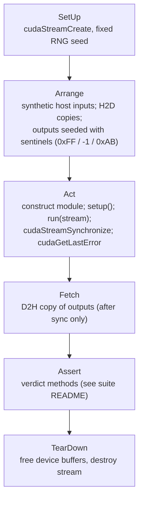

# cuMAC Unit Tests

GoogleTest-based unit tests for the cuMAC scheduler modules. Each
subdirectory builds one standalone test executable (`test_<module>`) that
links against the `cumac` library and is registered with CTest — run all
suites with `ctest`, or one executable directly (supports
`--gtest_filter`).

## Per-suite documentation

**Each subdirectory's README is the authoritative documentation for that
test suite.** It describes the module under test and its output contract,
the test objectives, the test design (scenario-by-scenario), the test
flow, and — most importantly — the correctness criteria: how functional
correctness is judged and the rationale for why that verdict method fits
the module. Start from the suite you care about:

| Suite | What it verifies | Verdict approach |
|---|---|---|
| [cellAssociation](cellAssociation/README.md) | per-UE serving-cell argmax | exact compare vs CPU reference, one-winner invariant, hand-planted winners |
| [multiCellMuUeSort](multiCellMuUeSort/README.md) | MU-MIMO UE priority sort (64TR) | exact rank-order compare vs host golden replica |
| [multiCellScheduler](multiCellScheduler/README.md) | multi-cell PF scheduler (17 kernel variants) | dual-mode: exact compare vs CPU reference / structural invariants |
| [multiCellSrsScheduler](multiCellSrsScheduler/README.md) | SRS resource scheduling + TPC | differential compare vs CPU reference over ~240 seeded scenarios, 0.01 dB power tolerance |
| [multiCellUeSelection](multiCellUeSelection/README.md) | per-cell top-K PF UE selection | exact compare vs hand-computed ids, ranking-flip designs |
| [muMimoUserPairing](muMimoUserPairing/README.md) | MU-MIMO pairing / grouping | field-by-field GPU-vs-CPU equivalence, spec-level group expectations |
| [roundRobinScheduler](roundRobinScheduler/README.md) | round-robin PRG allocation | order-independent invariants + multiset checks (nondeterministic kernel) |
| [singleCellScheduler](singleCellScheduler/README.md) | single-cell PF scheduler (MMSE/SVD) | exact compare vs CPU reference + tiling invariants, explicit tie case |

When adding a new suite, use these READMEs as the template and pick the
verdict method from the rules below.

## Shared conventions

### Test framework and flow

Every suite follows the same fixture flow; suite READMEs describe only
where they specialize it:

All CUDA return codes are checked; host reads happen only after stream
synchronization; randomized inputs always use a fixed seed.

### Correctness verdict methodology

The verdict method is chosen per output domain; suite READMEs cite these
rules by number:

1. **Discrete output, deterministic kernel** (total-order tie-break, and
   test inputs well-separated against float drift) → exact `EXPECT_EQ`
   against an oracle.
2. **Discrete output, nondeterministic kernel** (racy candidate
   discovery) → order-independent invariants + multiset/set comparison.
3. **Discrete decision from float metrics with small margins** → demote
   exact compare to structural invariants.
4. **Float contract output** → `EXPECT_NEAR` with a physically justified
   tolerance.
5. **Always layered on top**: structural invariants, sentinel checks for
   untouched memory, and at least one hand-computed expectation derived
   from the specification.
