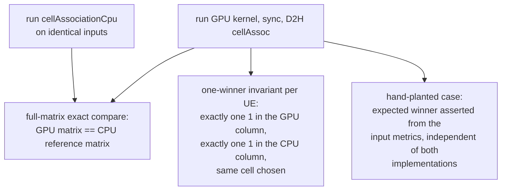

# test_cellAssociation

Unit tests for `cumac::cellAssociation` (`src/4T4R/cellAssociation.cu`):
per-UE serving-cell selection. For every UE the module computes the summed
channel gain `Σ |H|²` across all PRB groups and antenna pairs per cell and
associates the UE with the argmax cell. Two kernels are selected by
`setup()` based on problem size (`cellAssocParaPrbgCellKernel` with a
tree reduction over PRBGs, `cellAssocParaCellKernel` with a per-cell
linear accumulation); a CPU reference implementation
(`cellAssociationCpu`) ships with the library.

**Output under test** (discrete):

| Output | Type | Contract |
|---|---|---|
| `cellAssoc[cell*nUe + ue]` | `uint8_t` | `1` if the cell is the UE's argmax cell, else `0`; exactly one `1` per UE |

## Test objectives

1. Verify the argmax decision of both kernel variants against the CPU
   reference over the full association matrix.
2. Verify the structural contract independently of any reference: every UE
   is associated with exactly one cell, and CPU/GPU pick the same winner.
3. Verify the decision with an implementation-independent expectation: a
   hand-crafted metric layout whose correct winner is evident from the
   input itself.
4. Verify config validation: `totNumCell > 1024` terminates with the
   documented error (`EXPECT_EXIT` death test).

## Test design

| Test | Scenario intent |
|---|---|
| `SetupPicksParaPrbgCellKernelOnSmallDims` | small dims route to the PRBG-parallel kernel; full-matrix compare vs CPU reference on seeded Gaussian channels |
| `ParaPrbgCellKernelFinalCompareSelectsCellAssocIdx1` | deterministic hand-planted metrics ({5,10,2,1} / {1,2,5,10}); the expected winners are asserted absolutely, not via the reference |
| `SetupPicksParaCellKernelOnDefaultDims` | default dims route to the per-cell kernel; full-matrix compare vs CPU reference |
| `SetupOverflowsAndExitsWhenTotNumCellExceedsLimit` | `EXPECT_EXIT` with exit code 1 and the documented message |
| `HalfPrecisionInstantiationConstructsAndDestructs` | `__half2` template instantiation constructs, runs, and destructs cleanly |

Random channels use a fixed seed (`0xC0FFEE`) so every run judges the
same inputs.

## Test framework and flow

The suite follows the common fixture flow described in
[`test/README.md`](../README.md#test-framework-and-flow). The
suite-specific part is the verdict stage:

## Correctness criteria

### How correctness is judged

1. **Exact element-wise comparison** of the whole `nCell × nUe` association
   matrix against the CPU reference (`cellAssociationCpu`) run on identical
   inputs — every byte must match.
2. **One-winner invariant**: for each UE, both the CPU and the GPU column
   contain exactly one `1`, and it is the same cell. This holds regardless
   of the reference and catches malformed outputs (zero or multiple
   associations) directly.
3. **Hand-planted expected winners**: one scenario plants a deterministic
   metric layout and asserts the winning cells from the input arithmetic
   alone. This check would fail even if a bug existed identically in both
   the kernel and the CPU reference.
4. **Death test** for the documented `exit(1)` config guard, using
   GoogleTest's `threadsafe` death-test style (fork+exec, safe with CUDA).

### Verdict rationale

The output is a **discrete argmax decision**: a UE is either associated
with the right cell or it is not, so the verdict is exact comparison
(verdict rule 1 of
[`test/README.md`](../README.md#correctness-verdict-methodology)).

- **Both kernels are deterministic** — no atomics; fixed reduction
  schedules — so the association matrix is identical across launches and
  an exact compare cannot flake on scheduling.
- **The internal metric is float, but only the argmax is judged.** CPU and
  GPU accumulate in different orders (linear sum vs tree reduction), so
  metric values may differ at ULP level. The tests therefore use
  continuous Gaussian inputs (distinct metrics with margins far above
  rounding drift) and a hand-planted case with widely separated values —
  the discrete winner is unaffected by accumulation-order differences.
  Judging the decision rather than the metric keeps the verdict free of
  tolerance tuning.
- **Two independent evidence sources are combined.** The CPU reference
  provides broad coverage over randomized inputs; the hand-planted case
  anchors correctness to the specification itself. The one-winner
  invariant adds a structural guarantee that does not depend on either.
