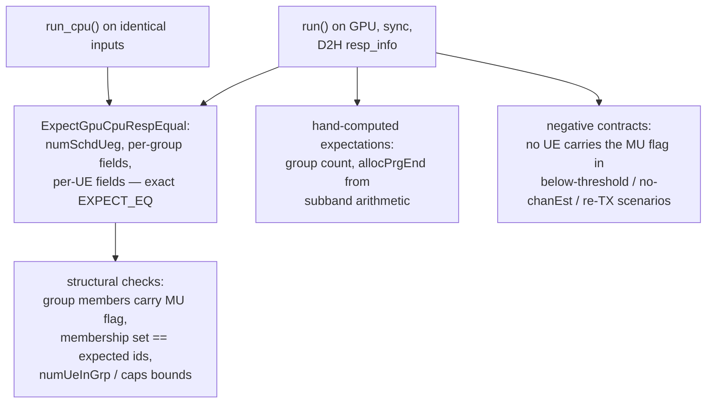

# test_muMimoUserPairing

Unit tests for `cumac::muMimoUserPairing`
(`src/muMimoUserPairing/muMimoUserPairing.cu`): MU-MIMO user pairing.
Stage 1 (`muUePairChanCorrKernel`, plus a memory-sharing variant) computes
the channel-orthogonality matrix from SRS channel estimates; stage 2
(`muUePairAlgKernel`, plus a memory-sharing variant) sorts candidates by
PF metric and greedily forms MU groups subject to orthogonality and
capacity constraints. The same source file ships CPU counterparts
(`run_cpu()`) used for differential verification.

**Output under test** (discrete): `cumac_muUeGrp_resp_info_t` —
`numSchdUeg`, per-group `allocPrgStart/allocPrgEnd/numUeInGrp/flags`, and
per-UE `rnti/id/layerSel/ueOrderInGrp/nSCID/flags`.

## Test objectives

1. Verify GPU/CPU functional equivalence of the full pairing response,
   field by field, on scenarios that form real MU groups.
2. Verify group semantics with spec-level expectations: group membership,
   MU flags, subband-dependent PRG ranges, and grouping caps.
3. Verify the negative contracts: no MU group is formed when SNR is below
   threshold, when a new-TX UE lacks a channel estimate, or for re-TX UEs.
4. Exercise every branch of both kernel stages and both memory-sharing
   variants (early returns, invalid-UE paths, multi-block rows, tight
   grouping limits, subband ternary) under CUDA error checking.

## Test design

The ~47 cases group into four categories:

| Category (representative tests) | Scenario intent | Verdict |
|---|---|---|
| Functional equivalence (`FunctionalEquivalence_GpuVsCpu_HappyPathMultiUe`, `_MemShare_HappyPathMultiUe`, `_MixedFirstMuThenSu`, `_NumSubbandTwo_AllocPrgEnd`) | MU groups formed from orthogonal candidates; mixed MU/SU population; two-subband PRG split | field-by-field exact compare GPU vs CPU + structural checks |
| Functional assertions (`FunctionalAssertion_SnrBelowThreshold_NoMuMimoScheduled`, `_NewTxNoChanEst_`, `_NotNewTx_`, `_TightGroupingLimits_CapEnforced`) | negative contracts and capacity caps | flag/absence invariants and cap bounds |
| Hand-computed expectations (inside the equivalence tests) | group count, membership {0,1}, `numUeInGrp == 2`, `allocPrgEnd == nPrg/2` for two subbands | absolute `EXPECT_EQ` from the spec |
| Branch coverage (`ChanCorr*`, `UePairAlg*` early-return / invalid-UE / multi-block / tight-limit variants, `SetupAcrossAllFlagAndMemSharingCombinations`) | drive each source branch of both stages and variants | CUDA error checks at every sync point |

## Test framework and flow

The suite follows the common fixture flow described in
[`test/README.md`](../README.md#test-framework-and-flow). The
suite-specific part is the differential verdict stage:

## Correctness criteria

### How correctness is judged

1. **Field-by-field exact comparison** of the complete response structure
   between the GPU kernels and the CPU counterparts run on identical
   inputs (`ExpectGpuCpuRespEqual`): group count, every per-group field,
   every per-UE field.
2. **Spec-level expectations** asserted absolutely inside the equivalence
   scenarios: exactly one group with both expected members
   (order-insensitive membership check), `numUeInGrp == 2`, and for the
   two-subband case `allocPrgEnd == nPrg/2` derived from the subband
   arithmetic.
3. **Negative contracts**: in below-threshold, missing-channel-estimate,
   and re-TX scenarios, no scheduled UE may carry the MU flag.
4. **Capacity invariants**: per-group UE count and total scheduled UEs
   bounded by the configured caps under tight-limit scenarios.

### Verdict rationale

The response structure is **purely discrete** (counts, ids, bitmasks, PRG
indices), so the verdict is exact comparison (verdict rule 1 of
[`test/README.md`](../README.md#correctness-verdict-methodology)).

- **Both sides compute a unique result.** The GPU bitonic sort orders by
  *(PF metric descending, uid ascending)* — a total order — and the
  grouping stage runs serially on one thread, so the GPU output does not
  depend on thread scheduling; the CPU counterpart sorts with the
  identical comparator. Exact equality is therefore well-defined even when
  metrics tie.
- **Inputs are chosen for float immunity.** PF metrics are well separated
  (distinct `currRate` per UE), and orthogonality values are exactly
  representable floats (1.0 / 0.9 / 0.3), so the kernel's threshold
  comparisons evaluate identically on CPU and GPU and ULP drift cannot
  change any grouping decision.
- **Differential equivalence is anchored by independent expectations.**
  The equivalence scenarios do not rely on GPU/CPU agreement alone: group
  count, membership, group size, and the subband PRG split are also
  asserted against values derived from the pairing specification, and the
  negative contracts pin the threshold semantics without reference to
  either implementation.
- **Branch-coverage scenarios** complete the picture by driving every
  early-return, invalid-input, multi-block, and memory-sharing path of
  both kernel stages under CUDA error checking, ensuring the verified
  behavior is reached through every dispatch variant.
