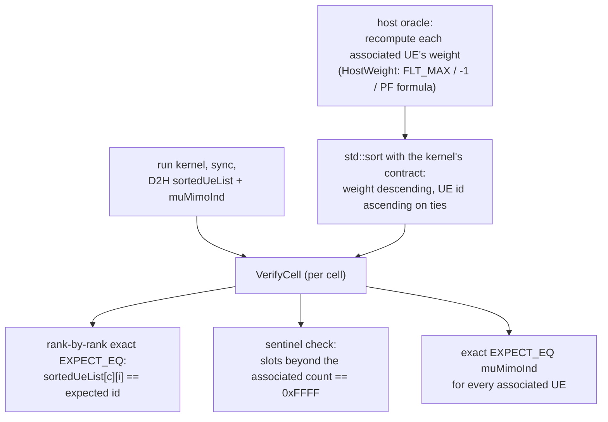

# test_multiCellMuUeSort

Unit tests for `cumac::multiCellMuUeSort`
(`src/64T64R/multiCellMuUeSort.cu`): the 64TR MU-MIMO UE priority sorter.
Per cell, the kernel computes a proportional-fair weight for every
associated UE and emits the UE ids in descending-weight order via an
in-shared-memory bitonic sort, together with a per-UE MU/SU eligibility
flag.

**Outputs under test** (all discrete):

| Output | Type | Contract |
|---|---|---|
| `sortedUeList[cell][rank]` | `uint16_t` | associated UE ids in descending weight order; unused slots = `0xFFFF` |
| `muMimoInd[ue]` | `uint8_t` | `1` if `srsWbSnr >= srsSnrThr` (MU-eligible), else `0`; written only for associated UEs |

The per-UE weight that drives the ordering:

- HARQ re-TX (`newDataActUe == 0`): weight = `FLT_MAX` (always sorts first, SU)
- new-TX with `bufferSize == 0`: skipped, weight stays `-1` (sorts last, still listed)
- otherwise: `pow(W · Σ_ant log2(1 + wbSinr), betaCoeff) · (muCoeff if MU) / avgRate`

## Test objectives

1. Verify the descending-weight ordering of `sortedUeList` for every weight
   branch: normal PF weight, MU boost (`muCoeff`), HARQ re-TX
   (`FLT_MAX`), and zero-buffer deprioritization (`-1`).
2. Verify `muMimoInd` against the `srsWbSnr >= srsSnrThr` threshold for
   every associated UE.
3. Verify the kernel writes nothing outside its contract: unused list
   slots keep the `0xFFFF` sentinel; empty cells produce an all-invalid
   list.
4. Cover structural edge cases of the bitonic sort network: single UE
   (smallest power-of-two network), non-power-of-two UE counts (padding
   entries), multi-cell with empty cells and unassociated UEs.

## Test design

Seven scenarios; each is judged by the full host-replica comparison
described under [Correctness criteria](#correctness-criteria):

| Test | Scenario intent |
|---|---|
| `NonHarqSortsFiveUesByDescendingWeight` | 5 UEs with distinct, well-separated weights, mixed MU/SU — drives the full sort network and both weight branches |
| `NonHarqSingleUeHitsSmallestPow2Base` | minimal sort case (n=1 → pow2 network of 2) |
| `NonHarqBufferSizeZeroIsDeprioritized` | `bufferSize==0` UEs keep weight `-1`, sort to the bottom, remain listed — includes a deliberate weight tie between two skipped UEs |
| `NonHarqEmptySecondCellProducesAllInvalid` | cell with no associated UE — its list stays all-`0xFFFF` |
| `HarqRetxUesSortToTop` | re-TX UEs (`FLT_MAX`) outrank every new-TX UE regardless of SINR |
| `HarqNewDataBufferSizeZeroIsDeprioritized` | HARQ path combined with zero-buffer skip |
| `HarqUnassociatedUeAndEmptyCell` | unassociated UEs excluded; empty cell on the HARQ path |

Inputs are chosen so that the resulting weights are **distinct and well
separated** (see rationale below); ties are only introduced where the
tie-break contract itself is being exercised.

## Test framework and flow

The suite follows the common fixture flow described in
[`test/README.md`](../README.md#test-framework-and-flow). The
suite-specific part is the oracle and verdict stage:

## Correctness criteria

### How correctness is judged

For every cell the test rebuilds the expected result on the host — weight
per associated UE, then the exact ordering — and compares the GPU output
**rank by rank with zero tolerance**, plus a sentinel check on every slot
the kernel must not touch and an exact check of every `muMimoInd` value.
A single misplaced rank, a stray write, or a wrong MU flag fails the test
with a message naming the cell, rank, expected UE and its weight.

### Verdict rationale

The output of this module is a **discrete ordering decision** — there is
no "approximately correct" rank, so the verdict is an exact comparison.
Two properties of the design make exact comparison safe (it cannot flake):

1. **The kernel's ordering is fully deterministic.** The bitonic-sort
   comparator in `multiCellMuUeSort.cu` orders by *(weight descending,
   UE id ascending)* — the id tie-break makes it a total order, so the
   sorted permutation is unique regardless of thread scheduling. The host
   oracle replicates exactly this comparator. Ties therefore have one
   correct answer on both sides, and the suite deliberately includes tied
   weights (`-1` skip markers) to keep that contract pinned.
2. **Weight separation is part of the test design.** The host oracle
   computes weights in double precision, the device in single precision —
   ULP-level differences are expected. Inputs are constructed so that
   distinct weights are separated by far more than this drift, so a
   rounding difference can never swap two ranks. Exactness is guaranteed
   by input design rather than bought with a tolerance.

With those two properties in place, exact comparison is the strongest
verdict available; the alternatives each check less:

- *Set comparison* (ignore order) would accept a broken sort — ordering is
  the module's entire purpose.
- *Weight tolerance comparison* would judge an internal quantity instead of
  the decision, and an off-by-one-rank bug with nearly equal weights would
  pass. Judging the discrete outcome is both stricter and free of
  tolerance-tuning.
- *A CPU reference class* does not exist for this module; the in-test host
  oracle plays that role while staying small enough to audit by eye, and
  the branch expectations (`FLT_MAX` first, `-1` last, MU boost applied)
  are asserted through scenarios whose correct outcome is evident from the
  specification rather than from the kernel source.

This suite is the reference example in this repository for verdict rule 1
of [`test/README.md`](../README.md#correctness-verdict-methodology):
*discrete output + deterministic kernel (total-order tie-break) → exact
comparison against an oracle, with input separation guaranteeing
float-drift immunity.*
