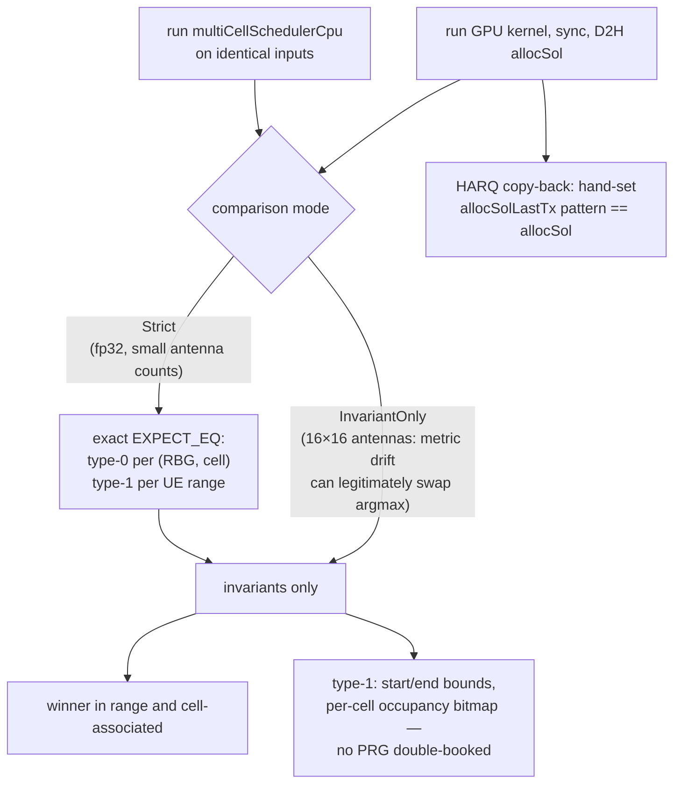

# test_multiCellScheduler

Unit tests for `cumac::multiCellScheduler`
(`src/4T4R/multiCellScheduler.cu`): the multi-cell proportional-fair
scheduler. `setup()`/`kernelSelect()` dispatch one of 17 kernel variants
over {DL/UL} × {allocation type 0/1} × {no precoding / SVD} ×
{fp32 / bf16} × {lightweight modes} × {Asim / non-Asim} × {HARQ on/off}.
The shipped CPU reference (`multiCellSchedulerCpu`) implements the same
scheduling policy with independent host code and algorithms.

**Outputs under test** (discrete):

| Output | Type | Contract |
|---|---|---|
| type-0: `allocSol[rbg*totNumCell + c]` | `int16_t` | selected UE per (RBG, cell); `-1` = none |
| type-1: `allocSol[2u], allocSol[2u+1]` | `int16_t` | per-UE contiguous PRG range `[start, end)`; `-1/-1` = unallocated |

## Test objectives

1. Verify the discrete allocation decisions of the fp32 DL kernels against
   the CPU reference on identical inputs.
2. Verify structural validity of every produced solution independently of
   the reference: winners in range and cell-associated, type-1 ranges
   non-overlapping per cell and in-bounds.
3. Verify HARQ pass-through semantics: a re-TX UE's previous allocation is
   reproduced verbatim.
4. Verify config validation: every unsupported configuration combination
   throws (17 `EXPECT_THROW` cases matching the `setup()` guard clauses).
5. Exercise every kernel-dispatch branch (bf16, lightweight, Asim
   wideband-SINR, UL variants) with scenario inputs that drive their
   internal paths (multi-round discovery, gap fill, peak collision,
   padding, allocation exhaustion, PRG masks).

## Test design

The ~80 cases group into six categories:

| Category (representative tests) | Scenario intent | Verdict |
|---|---|---|
| DL fp32 reference comparison (`DLType0NoPrecodingDefaultSelectsNoPrdMmseIrc`, `DLType1NoPrecodingColumnMajor*`, `DLType1NoPrecodingRowMajor*`, ...) | type-0 argmax and type-1 range assignment across kernel variants and association patterns | Strict: exact compare vs CPU reference + invariants |
| Large-antenna multi-round (`*LargeBsAntExercisesMultiRoundSched`, 16×16) | multi-round candidate discovery under heavy metric accumulation | InvariantOnly (see rationale) |
| SVD-precoding DL and UL (`DLType0SvdPrecoding*`, `ULType1SvdPrecoding*`) | SVD path decisions; UL PF rescale, peak collision, padding, exhaustion | invariants + allocation-count floors |
| Boundary semantics (`*NoAssociatedUeReturnsEarly`, `ULType1SvdPrecodingInfAvgRatesExercisesAllocExhaustion`) | no candidates / zero PF metric — outputs must remain at the `-1` sentinel | exact sentinel expectations |
| Asim HARQ (`AsimDLType1HarqWbSinrHarqCoversPrgMaskedReTx`, `AsimULType1Harq*`, ...) | HARQ re-TX copy-back, PRG masks, extend/skip branches | hand-set re-TX pattern reproduced exactly; remaining Asim branches judged by CUDA error checks |
| Config validation (17 `*Throws*` tests) | every unsupported {direction, alloc type, precoding, precision, lightweight} combination | `EXPECT_THROW` |

## Test framework and flow

The suite follows the common fixture flow described in
[`test/README.md`](../README.md#test-framework-and-flow). The
suite-specific part is the dual-mode verdict stage:

## Correctness criteria

### How correctness is judged

1. **Strict mode** (`ValidateAgainstCpuRef`): exact per-decision comparison
   against the CPU reference — type-0 selected UE per (RBG, cell), type-1
   `[start, end)` per UE — plus all invariants below.
2. **InvariantOnly mode**: for scenarios where float drift between CPU and
   GPU can legitimately change the argmax (large antenna counts), the
   equality step is dropped and the verdict rests on the invariants.
3. **Invariants** (both modes, and standalone for SVD/UL paths): selected
   UE index in range; selected UE actually associated with the cell;
   type-1 ranges in-bounds and non-overlapping per cell (occupancy
   bitmap); allocation-count floors where candidates exist.
4. **Exact sentinel expectations** for boundary semantics: no association
   and infinite `avgRates` (PF ≡ 0) must leave every allocation at
   `-1/-1`.
5. **Hand-set HARQ pass-through**: a re-TX pattern written into
   `allocSolLastTx` must be reproduced verbatim in `allocSol`.
6. **`EXPECT_THROW` config validation** covering each guard clause in
   `setup()`.

### Verdict rationale

The outputs are **discrete decisions**, so the primary verdict is exact
comparison; the suite applies verdict rules 1 and 3 of
[`test/README.md`](../README.md#correctness-verdict-methodology)
explicitly, per scenario:

- **Where exact comparison is used (Strict)**, its preconditions hold: the
  type-0 argmax is a serial ascending scan with strict `>` on both CPU and
  GPU (identical lowest-index tie-break), and the type-1 sort carries an
  id tie-break matching the CPU comparator. Inputs are fixed-seed,
  well-conditioned 4×4 channels, keeping decision margins above CPU/GPU
  float drift.
- **Where exact comparison is demoted (InvariantOnly)**, the demotion is
  itself a correctness statement: with 16×16 antennas the PF metric is
  accumulated with `atomicAdd` in nondeterministic order, and near-tied
  candidates can legitimately resolve differently between CPU and GPU.
  Asserting equality there would fail on correct behavior, so the verdict
  asserts what remains guaranteed — structural validity of the solution.
  This mirrors the umbrella decision tree: the tolerance for float drift
  is applied at the *mode* level, never by loosening a discrete compare.
- **The CPU reference is an independent implementation** — different
  algorithms for the type-1 assignment (sorted greedy extension vs the
  kernel's parallel peak riding) — so Strict agreement is meaningful
  evidence for the scheduling policy rather than a port comparison. The
  hand-set HARQ pattern and the sentinel boundary cases anchor semantics
  that no reference comparison could pin (pass-through fidelity, empty
  results).
- **Dispatch-coverage scenarios** (bf16, lightweight, remaining Asim
  branches) run each kernel variant to completion under CUDA error
  checking with branch-driving inputs; their role is exercising the
  dispatch and kernel paths, with decision-level verification carried by
  the categories above.
