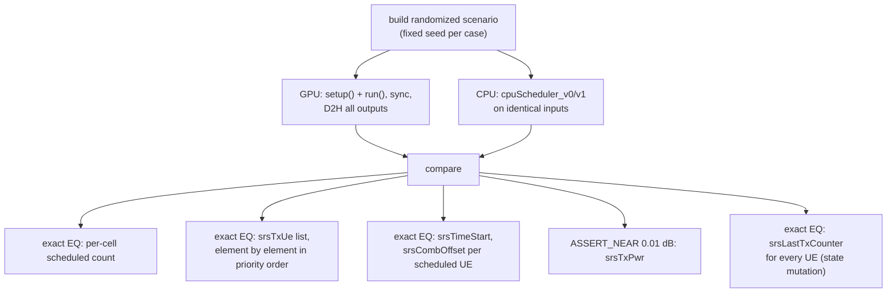

# test_multiCellSrsScheduler

Unit tests for `cumac::multiCellSrsScheduler`
(`src/multiCellSrsScheduler/multiCellSrsScheduler.cu`): SRS resource
scheduling. Kernel **v0** performs age-based (round-robin) selection via a
bitonic sort on per-UE aging counters; kernel **v1** (64TR) adds MU/SU
phases before the age phase. Both assign SRS time/comb resources and run a
TPC (transmit power control) routine. The class ships CPU reference
schedulers (`cpuScheduler_v0/v1`) used for differential verification.

**Outputs under test** (mixed domains):

| Output | Type | Contract |
|---|---|---|
| `nSrsScheduledUePerCell[c]` | count | number of UEs scheduled per cell |
| `srsTxUe[c][i]` | `uint16_t` | scheduled UE ids in priority order |
| `srsTimeStart[u]`, `srsCombOffset[u]` | discrete | assigned SRS symbol / comb resource slots |
| `srsLastTxCounter[u]` | state | reset to 0 if scheduled, incremented otherwise (all UEs) |
| `srsTxPwr[u]` | `float` | TPC transmit power in dB |

## Test objectives

1. Verify scheduling decisions (who is scheduled, in what priority order,
   on which time/comb resource) of both kernels against the CPU reference
   across randomized populations.
2. Verify the aging-state mutation (`srsLastTxCounter`) for every UE, not
   only the scheduled ones.
3. Verify the TPC power output across all accumulation/threshold branches.
4. Verify guard behavior: invalid SRS config/bandwidth indices, empty
   cells, and partially populated cells.

## Test design

| Test | Scenario intent |
|---|---|
| `V0_SmallPopulationRandomSeeds` / `V0_LargePopulationRandomSeeds` | 60 + 30 randomized seeds through the differential harness |
| `V0_InvalidConfigGuard` | `srsConfigIndex > 63` / `srsBwIndex > 3` drive the table-lookup guard |
| `V0_EmptyCellEarlyReturn` | cell with no candidates |
| `V0_TpcBranchSweep` | hand-crafted TPC combination table placing power-gap values inside each accumulation/threshold branch interval |
| `V1_RandomSeeds` / `V1_ThreeCells` | 80 + 20 randomized seeds; three-cell configuration |
| `V1_InvalidConfigGuard` / `V1_EmptyCellEarlyReturn` | v1 guard and empty-cell paths |
| `V1_PartialPopulationLoopCompletion` / `V1_PartialPopulationAgeCap` | partially populated cells; age-phase capacity cap |
| `CpuV1SmallPopulationFillsCell` | host-side scheduler fills the cell to its cap (aggregate expectation) |
| `DebugLogIsCallable` | public debug surface executes |

Roughly 240 randomized scenarios in total run through the same
differential harness (`RunAndCompare`), each with a distinct fixed seed.

## Test framework and flow

The suite follows the common fixture flow described in
[`test/README.md`](../README.md#test-framework-and-flow). The
suite-specific part is the differential harness:

## Correctness criteria

### How correctness is judged

1. **Exact comparison of every discrete decision** against the CPU
   reference on identical inputs: per-cell scheduled counts, the ordered
   `srsTxUe` lists, and the assigned `srsTimeStart`/`srsCombOffset`
   resource slots.
2. **Exact comparison of the aging-state mutation** for *all* UEs —
   scheduled UEs must reset to zero, unscheduled UEs must age — verifying
   the state the next TTI's decisions depend on.
3. **`ASSERT_NEAR` with 0.01 dB tolerance** on the TPC power output.
4. **Directed branch scenarios** (invalid config indices, empty cells,
   partial population, the hand-crafted TPC table) run through the same
   differential comparison, so guard paths are verified by outcome, not
   only by reaching them.

### Verdict rationale

The scheduling outputs are **discrete decisions**, judged by exact
comparison (verdict rule 1 of
[`test/README.md`](../README.md#correctness-verdict-methodology)); the
power output is a **float contract value**, judged with a physically
justified tolerance (rule 4).

- **Exact list comparison is safe despite parallel candidate discovery.**
  Candidates are scattered into shared memory with atomics (order varies),
  but the sort that produces the final list orders by *(aging descending,
  UE id ascending)* — a total order applied identically in the CPU
  reference — so the emitted priority list is unique. Ties in aging
  counters are common in randomized populations, and the shared id
  tie-break resolves them identically on both sides; the randomized sweeps
  exercise this continuously.
- **The 0.01 dB tolerance fits the TPC output domain.** TPC adjustments
  are branch-quantized in whole-dB steps, so any wrong branch produces an
  error of at least 1 dB — five orders of magnitude above the tolerance —
  while 0.01 dB comfortably absorbs libm-vs-device ULP differences in the
  underlying `log10` arithmetic. The tolerance separates rounding noise
  from decision errors with a wide margin on both sides.
- **Randomized seed sweeps plus directed branches** combine breadth and
  precision: ~240 seeded scenarios probe the decision logic across
  population shapes, while the hand-crafted TPC table places each power
  gap deliberately inside one branch interval, so every TPC branch is
  verified by its computed output value.
- **State mutation is part of the verdict.** Comparing
  `srsLastTxCounter` for every UE ensures round-robin fairness holds over
  time, not just within the tested TTI.
