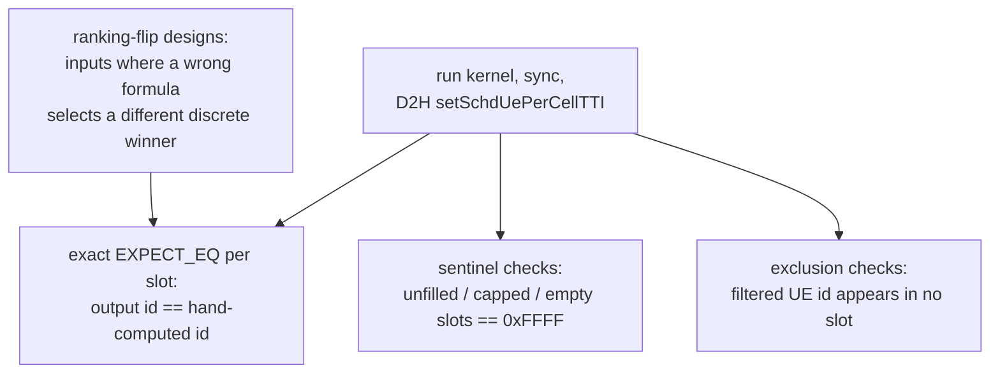

# test_multiCellUeSelection

Unit tests for `cumac::multiCellUeSelection`
(`src/4T4R/multiCellUeSelection.cu`): per-cell top-K UE selection for
scheduling. Per cell, the kernel computes a proportional-fair metric
`pow(W · Σ_ant log2(1 + SINR), betaCoeff) / max(avgRate, ε)` for every
associated candidate, forces HARQ retransmissions to maximum priority,
filters zero-buffer new-TX UEs, sorts by metric (bitonic sort), and emits
the top `numUeSchdPerCellTTI` UE ids. A heterogeneous kernel variant
applies per-cell caps.

**Output under test** (discrete):

| Output | Type | Contract |
|---|---|---|
| `setSchdUePerCellTTI[cell*K + slot]` | `uint16_t` | selected UE ids per cell in priority order; `0xFFFF` sentinel for unfilled slots |

## Test objectives

1. Verify top-K selection by PF priority, including every ingredient of
   the metric: the SINR-to-rate mapping, the per-antenna rate summation,
   the `betaCoeff` exponent, and the `avgRate` denominator.
2. Verify the priority overrides: HARQ re-TX forces maximum priority and
   bypasses the zero-buffer filter; `bufferSize == 0` new-TX UEs are
   excluded.
3. Verify the heterogeneous per-cell caps, including cap zero.
4. Verify sentinel behavior for unfilled slots, empty candidate sets, and
   per-cell association pools.

## Test design

| Test | Scenario intent |
|---|---|
| `HomogeneousBasic_SelectsHighestPriorityUes` | monotone SINR ramp — top-K by rate |
| `Heterogeneous_NumUeSchdPerCellTTIArr_CapsPerCell` | per-cell caps; capped slots hold `0xFFFF` |
| `HarqEnabled_RetransmissionForcesMaxPriority` | re-TX UE wins slot 0 over higher-SINR new-TX UEs |
| `Heterogeneous_HarqRetx_CoversHeteroRetxBranch` | re-TX priority on the hetero kernel |
| `BufferSizeNonNull_FiltersZeroBufferUe` | zero-buffer UE never appears in the output (exclusion check) |
| `Homogeneous_SingleCandidate_K1Pow2Path` | minimal sort network; sentinel in the second slot |
| `Homogeneous_NoCandidates_ProducesSentinel` | empty candidate set — all sentinel |
| `PfMetric_LowAvgRateOutranksHighSinr` | *ranking flip*: low-SINR UE with small `avgRate` must outrank high-SINR UE (metric 10 vs 2.32) |
| `MultiAntenna_SumsRatePerAntenna` | *ranking flip*: per-antenna SINR profile where antenna-sum ranking differs from antenna-0 ranking |
| `HarqRetx_BypassesZeroBufferFilter` | re-TX with zero buffer is still selected |
| `BetaCoeff_ExponentAltersPriorityOrder` | *ranking flip*: identical inputs run twice — β=1 selects UE0 first, β=2 selects UE1 first |
| `Heterogeneous_CapZero_EmitsAllSentinelForCell` | cap-zero cell emits only sentinels |
| `MultiCell_DistinctAssociation_RespectsPerCellPool` | globally best UE is not selected by a cell it is not associated with |

All expected ids are **hand-computed from the PF formula**, with the
arithmetic documented in comments next to each scenario.

## Test framework and flow

The suite follows the common fixture flow described in
[`test/README.md`](../README.md#test-framework-and-flow). The
suite-specific part is the verdict stage:

## Correctness criteria

### How correctness is judged

1. **Exact slot-by-slot comparison** of the emitted UE ids against
   hand-computed expectations derived from the PF formula.
2. **Sentinel checks**: every slot the kernel must not fill (per-cell cap,
   exhausted candidates, cap-zero cell) holds `0xFFFF`.
3. **Exclusion checks**: UEs that must be filtered (zero buffer) are
   asserted absent from every slot (`EXPECT_NE`), independent of ordering.
4. **Ranking-flip scenarios** verify the floating-point metric through the
   discrete outcome: for each formula ingredient (denominator, antenna
   summation, exponent) the inputs are constructed so that the correct
   formula and a plausible wrong one produce *different winners*. The
   `betaCoeff` case runs the same inputs twice and asserts the winner
   changes with the exponent.

### Verdict rationale

The output is a **discrete top-K decision**, so the verdict is exact
comparison (verdict rule 1 of
[`test/README.md`](../README.md#correctness-verdict-methodology)).

- **The sort result is unique.** Candidate discovery uses atomic scatter,
  but the bitonic-sort comparator orders by *(metric descending, UE id
  ascending)* — a total order — so the emitted ranking does not depend on
  thread scheduling. In addition, every scenario uses well-separated
  metric values, so ULP-level drift in `log2f`/`powf` cannot reorder any
  pair; the verdict does not depend on floating-point equality at all.
- **The oracle is fully independent.** Expected ids come from hand
  arithmetic documented in the test comments, not from any implementation.
  There is no reference code whose bugs could propagate into the
  expectations.
- **Float correctness is judged through discrete observables.** Rather
  than reading back internal metrics and comparing them with a tolerance,
  the ranking-flip designs make each numeric ingredient of the formula
  decide a discrete winner. A wrong denominator, a missed antenna term, or
  an ignored exponent each flips a specific test's outcome — a
  tolerance-free verdict that pins the formula itself.
