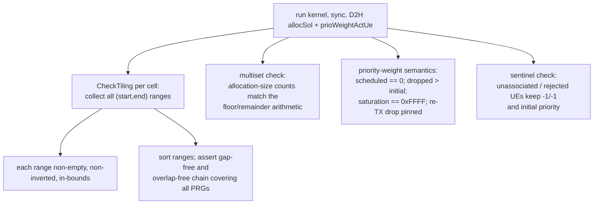

# test_roundRobinScheduler

Unit tests for `cumac::roundRobinScheduler`
(`src/4T4R/roundRobinScheduler.cu`): the GPU multi-cell round-robin PRG
allocator, kernels `roundRobinSchedulerKernel_type1` (non-HARQ),
`roundRobinSchedulerKernel_type1_harq` (HARQ re-TX reservation), and the
`kernelSelect` dispatch.

**Outputs under test** (all discrete — no floating point is involved):

| Output | Type | Contract |
|---|---|---|
| `allocSol[2u], allocSol[2u+1]` | `int16_t` | per-UE contiguous PRG range `[start, end)`; `-1/-1` = unallocated |
| `prioWeightActUe[u]` | `uint16_t` | reset to `0` if scheduled; `+prioWeightStep` (saturating at `0xFFFF`) if dropped; pinned to `0xFFFF` for a dropped HARQ re-TX |

## Test objectives

1. Verify the round-robin allocation contract: all PRGs of a cell are tiled
   gap-free and overlap-free across its scheduled UEs, with per-UE shares
   equal to `floor(nPrbGrp / nUe)` plus at most one remainder PRG.
2. Verify HARQ semantics: re-TX UEs reserve their previous allocation
   verbatim before new-TX UEs split the remainder; overflowing re-TX UEs
   are dropped with priority pinned.
3. Verify the priority-weight lifecycle (reset / bump / saturate / pin) and
   that unassociated or rejected UEs are left untouched.
4. Verify config validation: `allocType == 0` is rejected at `setup()`
   without any kernel launch.

## Test design

Thirteen scenarios, each judged by the invariant set described under
[Correctness criteria](#correctness-criteria):

| Test | Scenario intent |
|---|---|
| `Type1EvenSplitTilesAllPrgs` | nPrbGrp divisible by nUe — every UE gets an equal share |
| `Type1UnevenSplitDistributesRemainder` | remainder PRGs — exactly one UE gets `floor+1`, rest get `floor` |
| `Type1MoreUesThanPrgsLeavesSurplusUnallocated` | capacity pressure — winner/loser counts, losers keep `-1/-1` and get a priority bump |
| `Type1EmptyCellEarlyReturnLeavesUntouchedUes` | cell with no associated UE — sentinels intact |
| `Type1MultiCellEachCellTilesOwnPrgAxis` | two cells tile independent PRG axes; per-cell counts |
| `AllocTypeZeroIsRejectedWithoutLaunch` | setup-only; all outputs must remain at their sentinels |
| `Type1HarqReTxReservesThenNewTxSplitsRemainder` | re-TX ranges reproduced verbatim; new-TX UEs split what is left |
| `Type1HarqReTxOverflowDropsAndPinsPriority` | two symmetric re-TX UEs compete for insufficient PRGs — exactly one fits (either/or check), the dropped one is pinned to `0xFFFF` |
| `Type1HarqNewTxRemainderGivesExtraPrg` | HARQ path remainder arithmetic |
| `Type1HarqNewTxMoreUesThanPrgsDropsSurplus` | HARQ path capacity pressure |
| `Type1HarqEmptyCellEarlyReturn` | HARQ path empty cell |
| `Type1UnallocatedPrioritySaturatesAtCeiling` | priority bump saturates at `0xFFFF`, does not wrap |
| `Type1HarqNewTxUnallocatedPrioritySaturatesAtCeiling` | same on the HARQ path |

Expected values in these tests are **hand-computed from the round-robin
specification** (floor/remainder arithmetic, documented in comments next to
each scenario) — they are not derived from any implementation, so a bug in
the kernel cannot leak into the expectations.

## Test framework and flow

The suite follows the common fixture flow described in
[`test/README.md`](../README.md#test-framework-and-flow). The
suite-specific part is the verdict stage:

## Correctness criteria

### How correctness is judged

No golden per-UE comparison is used. The verdict is a set of
**order-independent invariants** that together pin down every promise the
round-robin specification makes:

1. **Tiling invariant** (`CheckTiling`): every allocated range satisfies
   `start >= 0`, `end > start`, `end <= nPrbGrp`; after sorting, the ranges
   form a contiguous, non-overlapping chain that covers exactly the
   expected number of PRGs. This single check simultaneously proves
   no PRG is double-booked, no PRG is leaked, and no range is malformed.
2. **Share multiset**: the multiset of allocation sizes must equal the
   hand-computed floor/remainder distribution (e.g. "one UE gets 3 PRGs,
   two UEs get 2"). *Which* UE gets the remainder is deliberately not
   asserted.
3. **Either/or checks** for symmetric competition: when two identical
   re-TX UEs compete for insufficient space, the test asserts exactly one
   wins and one is dropped — whichever it is.
4. **Priority-weight semantics**: scheduled UEs reset to 0; dropped UEs
   strictly increase (checked with `EXPECT_GT` against the initial value,
   so the verdict stays valid on builds that re-launch the kernel for
   timing measurement); saturation and re-TX pinning checked exactly.
5. **Sentinel checks**: UEs the kernel must not touch (unassociated, empty
   cell, rejected config) retain their seeded `-1/-1` and initial priority
   — this proves the kernel writes nothing outside its contract.

### Verdict rationale

The kernel is **intentionally nondeterministic**: associated UEs are
discovered by concurrent threads and packed into the work list with
`atomicAdd` (`roundRobinScheduler.cu`, UE-discovery loops of both kernels),
so the order of UEs in the internal list — and therefore *which UE receives
the remainder PRG, which specific sub-range each UE gets, and which of two
equal re-TX UEs is dropped first* — legitimately varies from launch to
launch. This is not a defect; the round-robin contract only promises
set-level fairness properties, not a specific assignment.

The verdict method follows from this:

- **Exact golden comparison (e.g. against `roundRobinSchedulerCpu`) is not
  applicable here**: it would assert an ordering the specification does not
  promise, and would fail spuriously whenever the GPU's atomic packing
  order differs from the CPU's loop order.
- **The invariant set matches the specification exactly.** Every property
  the algorithm guarantees (complete tiling, fair shares,
  reservation-before-split, priority lifecycle, untouched-memory) is
  asserted; every property it does not guarantee (who gets the remainder)
  is left free. The verdict neither false-fails on legitimate
  nondeterminism nor false-passes a real contract violation: a lost PRG
  breaks the tiling chain, a double allocation breaks non-overlap, an
  unfair split breaks the multiset, a wrong priority update breaks the
  lifecycle check.
- **Expectations are implementation-independent.** All expected values come
  from floor/remainder arithmetic in the test comments rather than from
  running any reference code, so a bug in the kernel cannot leak into the
  expectations.

This suite is the reference example in this repository for verdict rule 2
of [`test/README.md`](../README.md#correctness-verdict-methodology):
*discrete output + nondeterministic kernel → invariants + multiset
comparison.*
