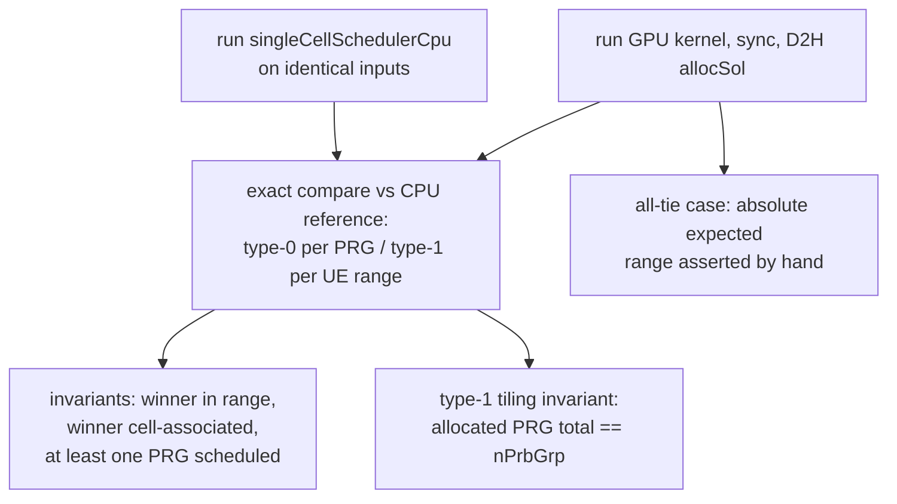

# test_singleCellScheduler

Unit tests for `cumac::singleCellScheduler`
(`src/4T4R/singleCellScheduler.cu`): the single-cell proportional-fair
scheduler. Kernels compute per-(UE, PRG) PF metrics via an MMSE receiver
(Gauss-Jordan inverse of `H^H·H + σ²I`, `log2` rates, divided by
`avgRate`) and then discretize: **type-0** selects the argmax UE per PRG;
**type-1** assigns contiguous per-UE PRG ranges via a global sort plus
sequential range extension. Variants cover no-precoding, SVD precoding,
and a cooperative type-1 kernel. The shipped CPU reference
(`singleCellSchedulerCpu`) implements the same scheduling policy with
independent host code (`cpuMatAlg` matrix routines, `std::sort`-based
type-1 assignment).

**Outputs under test** (discrete):

| Output | Type | Contract |
|---|---|---|
| type-0: `allocSol[prg*nCell + cellId]` | `int16_t` | argmax UE index per PRG; `-1` = none |
| type-1: `allocSol[2u], allocSol[2u+1]` | `int16_t` | per-UE contiguous PRG range `[start, end)` |

## Test objectives

1. Verify the discrete scheduling decisions of every kernel variant
   (no-precoding / SVD, type-0 / type-1, single- and multi-round UE
   discovery) against the CPU reference on identical inputs.
2. Verify structural validity independently of the reference: selected UEs
   are in range and cell-associated; type-1 ranges tile the full PRG axis.
3. Pin the tie-break contract with an all-tie scenario whose outcome is
   asserted absolutely.
4. Verify config validation: the unsupported SVD + type-1 combination
   terminates with the documented error.

## Test design

| Test | Scenario intent |
|---|---|
| `NoPrecodingType0MatchesCpu` / `SvdPrecodingType0MatchesCpu` | full-buffer exact compare vs CPU reference, both precoding paths |
| `Type1ConsecutiveMatchesCpu` | type-1 range assignment vs CPU reference + tiling invariant |
| `PartialAssociationType0MatchesCpu` / `SvdPartialAssociationMatchesCpu` / `Type1PartialAssociationMatchesCpu` | association masks — unassociated UEs must never win |
| `DefaultPrecodingRoutesToNoPrd` | dispatch fallback path, judged by CPU compare |
| `NoPrecodingType0MultiRound` / `SvdPrecodingType0MultiRound` / `Type1MultiRound` | 64 UEs force multi-round candidate discovery, judged by CPU compare |
| `Type1NoAssociationReturnsEarly` | no candidates — outputs remain zero on both sides |
| `Type1UpwardExtensionMatchesCpu` | **all-tie scenario**: identical metrics for every (UE, PRG) — asserts the absolute expected range `[0, nPrbGrp)` and CPU/GPU agreement |
| `SvdType1CombinationIsUnavailableAndAborts` | `EXPECT_EXIT` on the unsupported combination |

Random channels use a fixed seed (`0x5C5C5C5C`).

## Test framework and flow

The suite follows the common fixture flow described in
[`test/README.md`](../README.md#test-framework-and-flow). The
suite-specific part is the verdict stage:

## Correctness criteria

### How correctness is judged

1. **Exact comparison against the CPU reference.** Type-0: per-PRG selected
   UE (`EXPECT_EQ`); type-1: per-UE `[start, end)` ranges. Both output
   buffers are zero-initialized identically on the two sides, so the full
   buffer compare also proves the kernel wrote nothing outside its
   contract.
2. **Invariants layered on the compare** so that a degenerate agreement
   cannot pass: the selected UE must be in `[-1, nUe)` and actually
   associated; at least one PRG must be scheduled in scenarios that have
   candidates; type-1 allocations must sum to exactly `nPrbGrp`.
3. **An explicit all-tie scenario** (`MakeUePrgsIdentical`) pins the
   tie-break behavior with an absolute, hand-stated expectation rather
   than relying on reference agreement alone.
4. **Death test** for the unsupported kernel combination.

### Verdict rationale

The outputs are **discrete decisions** (argmax per PRG, range per UE), so
the verdict is exact comparison (verdict rule 1 of
[`test/README.md`](../README.md#correctness-verdict-methodology)).

- **The kernel is deterministic and its tie-breaks align with the CPU
  reference.** Candidate discovery uses an atomic counter only for
  counting — the rank-to-UE mapping is a fixed sequential scan. The
  type-0 argmax scans candidates in ascending order with strict `>` on
  both CPU and GPU (identical lowest-index tie-break); the type-1 bitonic
  sort carries an explicit id tie-break matching the CPU `std::sort`
  comparator. Ties therefore have one correct answer on both sides — the
  all-tie test passes by contract, not by luck.
- **Float sensitivity is handled by input design.** The PF metrics are
  float-computed with different operation orders on CPU and GPU
  (Gauss-Jordan in shared memory vs host loops), so metric values differ
  at ULP level. Test channels are well-conditioned Gaussian draws with a
  fixed seed, giving decision margins far above that drift; the discrete
  compare judges only the decision, never the metric value.
- **The CPU reference is structurally different code** — host matrix
  routines and a sort-plus-greedy type-1 assignment vs the kernel's
  parallel range extension — so agreement between the two is meaningful
  evidence for the scheduling policy, and the all-tie hand case plus the
  structural invariants anchor the points a reference compare alone would
  not (tie-break contract, tiling completeness, association validity).
