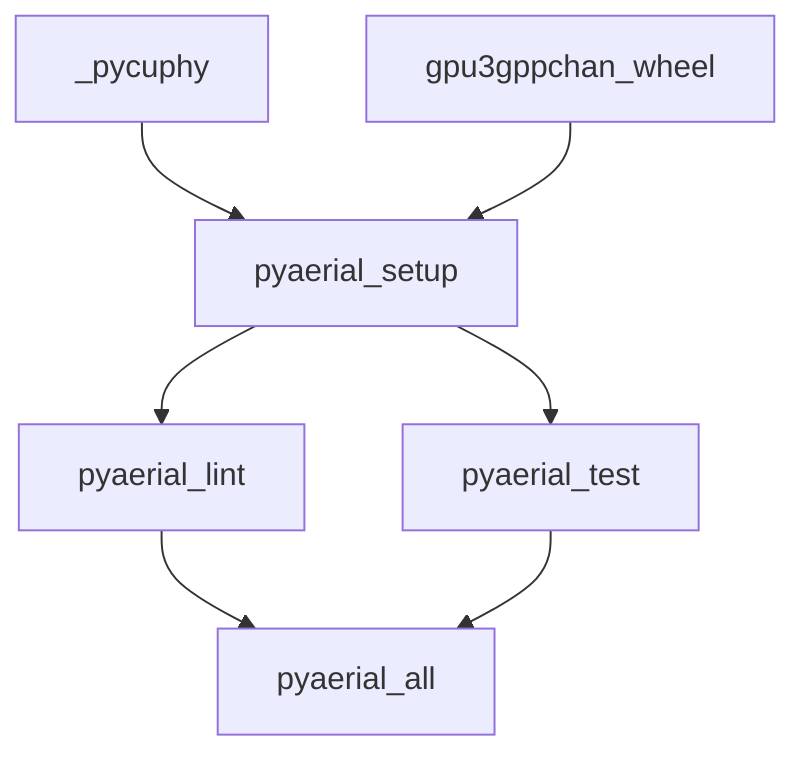

# pyAerial developer guide

The goal of pyAerial is to provide a documented Python API to everything in Aerial. Currently, it provides a Python API to a subset of cuPHY functionality.

pyAerial is in particular intended towards machine learning researchers, and can be used for example in model validation, model benchmarking, dataset generation and in generating ground truth signals for over the air collected datasets. Such ground truth signals can be for example transmitted MAC PDUs (obtained via detection), coded bits (via re-encoding the information bits) or the transmitted symbols.

## Environment setup

pyAerial runs inside the standard Aerial devel container:

```bash
./cuPHY-CP/container/run_aerial.sh
```

Python dependencies are managed in an isolated virtual environment at `pyaerial/.venv`, created by CMake:

```bash
cd $cuBB_SDK
cmake --preset pyaerial-x86
cmake --build --preset pyaerial-x86 --target pyaerial_setup
source pyaerial/.venv/bin/activate   # shell prompt shows (pyaerial)
python3 -c "import aerial"
```

For local development on the native toolchain, use `pyaerial-arm` on aarch64 instead of `pyaerial-x86`.

## CMake configure presets

pyAerial uses dedicated presets that inherit the CI test presets and bundle the flags required for pyAerial builds:

| Preset | Platform | Inherits | Build directory |
|--------|----------|----------|-----------------|
| `pyaerial-x86` | x86_64 | `cicd-test-x86` | `build-pyaerial-x86/` |
| `pyaerial-arm` | aarch64 | `cicd-test-arm` | `build-pyaerial-arm/` |

Matching **test presets** (`ctest --preset …`) use the same names and filter CTest to label `pyaerial`.

Both presets set:

- `NVIPC_FMTLOG_ENABLE=OFF`
- `ASIM_CUPHY_SRS_OUTPUT_FP32=ON`
- `ENABLE_PYAERIAL=ON` (via the inherited preset)

No extra `-D` flags are needed on the command line when using these presets.

## CMake targets reference

All `pyaerial_*` targets are defined in `pyaerial/cmake/PythonEnv.cmake` and require `ENABLE_PYAERIAL=ON` (set by the presets below). Use the matching build preset, for example:

```bash
cmake --build --preset pyaerial-x86 --target <target>
```

### Native artifacts (upstream)

| Target | Purpose |
|--------|---------|
| `_pycuphy` | Build the pybind11 `_pycuphy` extension. Required before any `pyaerial_*` target that imports aerial. |
| `gpu3gppchan_wheel` | Package the CMake-built `gpu3gppchan` library and nanobind extension into a Linux wheel without recompiling them from `setup_venv.sh`. |

### Custom targets

| Target | Depends on | Action |
|--------|------------|--------|
| `pyaerial_setup` | `_pycuphy`, `gpu3gppchan_wheel`, `pyproject.toml`, `setup.py` | Copy `_pycuphy`, install the prebuilt `gpu3gppchan` wheel, then create or reuse the editable pyAerial environment (skipped when the build stamp is up to date) |
| `pyaerial_lint` | `pyaerial_setup` (stamp) | Static analysis via `scripts/run_static_tests.sh` (flake8, pylint, mypy, interrogate) |
| `pyaerial_test` | `pyaerial_setup` | Full pytest suite via `scripts/run_unit_tests.sh` (GPU + test vectors) |
| `pyaerial_all` | `pyaerial_lint`, `pyaerial_test` | Run lint and unit tests in one invocation |
| `pyaerial_clean_venv` | — | Remove `pyaerial/.venv` |



### Environment variables

| Variable | Used by | Default | Purpose |
|----------|---------|---------|---------|
| `BUILD_ID` | `pyaerial_setup` | `1` | Package version metadata (read at pip build time) |
| `TEST_VECTOR_DIR` | `pyaerial_test` | `/mnt/cicd_tvs/develop/GPU_test_input/` | Root path for cuPHY test vectors (read at pytest runtime) |

`PYAERIAL_ARCH` (`amd64` or `arm64`) is set automatically from the CMake system processor; override when calling the setup script directly.

**Incremental setup:** `pyaerial_setup` writes a stamp file under the build tree (`build-pyaerial-x86/pyaerial/pyaerial_venv.stamp`). Ninja re-runs setup when `_pycuphy`, the completed `gpu3gppchan` wheel artifact, `pyproject.toml`, `setup.py`, or `setup_venv.sh` change — not when arbitrary channel-model source files are merely scanned. The script reuses an existing `pyaerial/.venv` instead of recreating it. Activating the venv in your shell is optional; CMake targets always use `pyaerial/.venv/bin/python` via `_env.sh`. For the fastest edit/lint loop, run `bash pyaerial/scripts/run_static_tests.sh` directly after the first `pyaerial_setup`. Force a full refresh with `pyaerial_clean_venv` then `pyaerial_setup`.

### CTest integration

When `ENABLE_TESTS=ON` (default), the lint and test checks are also registered as CTest tests with label `pyaerial`. They are **not** run by `ctest --preset cicd-test-x86` (that preset filters `cuphy-cp` only).

| CTest name | Fixture | Invokes target | Labels |
|------------|---------|----------------|--------|
| `pyaerial_build_setup` | sets `pyaerial_env` | `pyaerial_setup` | `pyaerial` |
| `pyaerial_lint` | requires `pyaerial_env` | `pyaerial_lint` | `pyaerial` |
| `pyaerial_test` | requires `pyaerial_env` | `pyaerial_test` | `pyaerial;requires-gpu;requires-tvs` |

| Test preset | Configure preset | Label filter |
|-------------|------------------|--------------|
| `pyaerial-x86` | `pyaerial-x86` | `pyaerial` |
| `pyaerial-arm` | `pyaerial-arm` | `pyaerial` |

Run all pyAerial CTest checks:

```bash
cmake --preset pyaerial-x86
cmake --build --preset pyaerial-x86 --target _pycuphy
ctest --preset pyaerial-x86
```

Lint only: `ctest --preset pyaerial-x86 -R pyaerial_lint`

### CI entry point

`scripts/run_pyaerial_ci.sh` configures with the pyAerial preset, builds `_pycuphy`, then runs `ctest --preset …`. Environment variables: `PRESET`, `BUILD_ID`, `TEST_VECTOR_DIR`. No per-test CTest timeout is set — the suite runs uncapped (matching the develop pipeline); the Jenkins job timeout is the backstop.

Jenkins CI (`jenkinsfile/Jenkinsfile_cuphy_container_unit_test_pipeline` with `RUN_PYAERIAL=true`) runs the pyAerial test stage from the single `pyaerial_testing` GitLab job (`pyaerial-x86` preset). Set `ARM_NODE_LABEL` on the Jenkins job to the aarch64 executor label.

```bash
bash pyaerial/scripts/run_pyaerial_ci.sh
```

## Running pyAerial tests

See [CMake targets reference](#cmake-targets-reference) for all targets and CTest names.

Quick start after configure:

```bash
cmake --build --preset pyaerial-x86 --target pyaerial_all
```

Or run checks individually / via CTest:

```bash
cmake --build --preset pyaerial-x86 --target pyaerial_lint pyaerial_test
ctest --preset pyaerial-x86                     # lint + test
ctest --preset pyaerial-x86 -R pyaerial_lint    # lint only
```

Unit tests use cuPHY test vectors under `/mnt/cicd_tvs/develop/GPU_test_input/` by default, or set `TEST_VECTOR_DIR` before `cmake --preset`.

Or invoke scripts directly after `pyaerial_setup`:

```bash
source pyaerial/.venv/bin/activate   # shell prompt shows (pyaerial)
$cuBB_SDK/pyaerial/scripts/run_static_tests.sh
$cuBB_SDK/pyaerial/scripts/run_unit_tests.sh
```

## Example notebooks

```bash
source pyaerial/.venv/bin/activate   # shell prompt shows (pyaerial)
cd $cuBB_SDK/pyaerial/notebooks
jupyter lab --ip=0.0.0.0
```

Pre-execute all notebooks:

```bash
$cuBB_SDK/pyaerial/scripts/run_notebooks.sh
```

Dependencies for notebooks are installed via the `notebooks` extra in `pyproject.toml` (included in `pyaerial_setup`).

## Python dependencies

Runtime and dev dependencies are declared in `pyaerial/pyproject.toml`:

- `dev` — lint and test tools
- `ml` — torch 2.12.1+cu132, TensorRT, onnx (`pyaerial_setup` passes `--extra-index-url https://download.pytorch.org/whl/cu132` automatically; for manual `pip install`, use the same flag)
- `ml-amd64` / `ml-arm64` — platform-specific onnxruntime packages
- `notebooks` — jupyter, ipympl, nbconvert, clickhouse-connect (installed by `pyaerial_setup`)

TensorRT pip packages are pinned to match the system TensorRT installed in the Aerial devel container.
